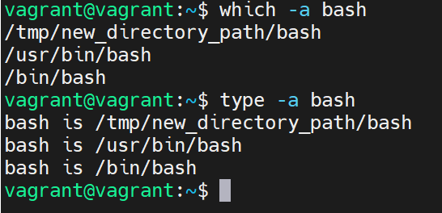

8.  какой переменной можно задать длину журнала history, и на какой строчке manual это описывается?
```
* HISTFILESIZE, описывается на 626 строке
* HISTSIZE, описывается на 635 строке
```
8. что делает директива ignoreboth в bash?
```
директива для HISTCONTROL, которая позволяет не сохранять команды которые 
начинаются с пробела и которые соответствуют предыдущей записи в истории
```
9. В каких сценариях использования применимы скобки {} и на какой строчке man bash это описано?
```
206 строка, выполнение списка команд
143 строка, использование зарезервированных выражений
```
10. Основываясь на предыдущем вопросе, как создать однократным вызовом touch 100000 файлов? А получилось ли создать 300000? Если нет, то почему?
```
touch file-{0..100000}
не получилось, список аргументов слишком длинный

* Список считается слишком длинным, потому что он фактически расширяет команду для каждого файла, создавая очень длинную командную строку.
* Предел задается размером списка аргументов в байтах, добавленным к размеру среды оболочки.
* В моем случае максимальным было число 116094
```

11. В man bash поищите по /\[\[. Что делает конструкция [[ -d /tmp ]]
```
проверяет существует ли директория tmp
```
12. Основываясь на знаниях о просмотре текущих (например, PATH) и установке новых переменных; командах, которые мы рассматривали, добейтесь в выводе type -a bash в виртуальной машине наличия первым пунктом в списке:



13. Чем отличается планирование команд с помощью batch и at?
```
команда at используется для назначения одноразового задания на заданное время, а команда batch — 
для назначения одноразовых задач, которые должны выполняться, когда загрузка системы становится меньше 0,8
```
