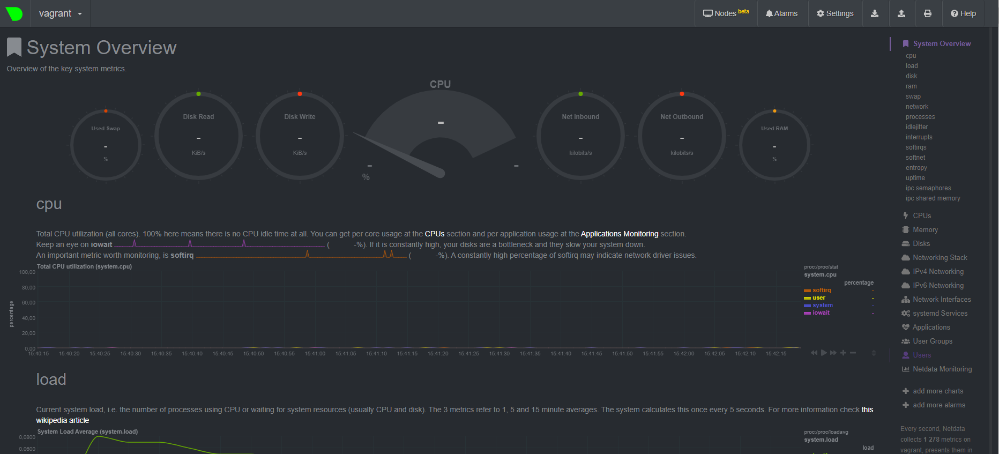
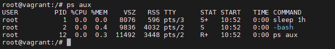

# Домашнее задание к занятию "3.4. Операционные системы, лекция 2"

1. На лекции мы познакомились с [node_exporter](https://github.com/prometheus/node_exporter/releases). В демонстрации его исполняемый файл запускался в background. Этого достаточно для демо, но не для настоящей production-системы, где процессы должны находиться под внешним управлением. Используя знания из лекции по systemd, создайте самостоятельно простой [unit-файл](https://www.freedesktop.org/software/systemd/man/systemd.service.html) для node_exporter:

    * поместите его в автозагрузку,
    * предусмотрите возможность добавления опций к запускаемому процессу через внешний файл (посмотрите, например, на `systemctl cat cron`),
    * удостоверьтесь, что с помощью systemctl процесс корректно стартует, завершается, а после перезагрузки автоматически поднимается.

Unit-файл
```
vagrant@vagrant:~$ systemctl cat node_exporter
# /lib/systemd/system/node_exporter.service
[Unit]
Description=Node_exporter service

[Service]
EnvironmentFile=/etc/default/node_exporter
ExecStart=/sbin/node_exporter/node_exporter

[Install]
WantedBy=default.target

```
статус
```
vagrant@vagrant:~$ systemctl status node_exporter
● node_exporter.service - Node_exporter service
     Loaded: loaded (/lib/systemd/system/node_exporter.service; enabled; vendor preset: enabled)
     Active: active (running) since Sun 2021-11-21 05:09:08 UTC; 2s ago
   Main PID: 4262 (node_exporter)
      Tasks: 4 (limit: 1071)
     Memory: 2.4M
     CGroup: /system.slice/node_exporter.service
             └─4262 /sbin/node_exporter/node_exporter

Nov 21 05:09:08 vagrant node_exporter[4262]: ts=2021-11-21T05:09:08.566Z caller=node_exporter.go:115 level=info collector=thermal_zone
Nov 21 05:09:08 vagrant node_exporter[4262]: ts=2021-11-21T05:09:08.566Z caller=node_exporter.go:115 level=info collector=time
Nov 21 05:09:08 vagrant node_exporter[4262]: ts=2021-11-21T05:09:08.566Z caller=node_exporter.go:115 level=info collector=timex
Nov 21 05:09:08 vagrant node_exporter[4262]: ts=2021-11-21T05:09:08.566Z caller=node_exporter.go:115 level=info collector=udp_queues
Nov 21 05:09:08 vagrant node_exporter[4262]: ts=2021-11-21T05:09:08.566Z caller=node_exporter.go:115 level=info collector=uname
Nov 21 05:09:08 vagrant node_exporter[4262]: ts=2021-11-21T05:09:08.566Z caller=node_exporter.go:115 level=info collector=vmstat
Nov 21 05:09:08 vagrant node_exporter[4262]: ts=2021-11-21T05:09:08.566Z caller=node_exporter.go:115 level=info collector=xfs
Nov 21 05:09:08 vagrant node_exporter[4262]: ts=2021-11-21T05:09:08.566Z caller=node_exporter.go:115 level=info collector=zfs
Nov 21 05:09:08 vagrant node_exporter[4262]: ts=2021-11-21T05:09:08.566Z caller=node_exporter.go:199 level=info msg="Listening on" address=:9100
Nov 21 05:09:08 vagrant node_exporter[4262]: ts=2021-11-21T05:09:08.566Z caller=tls_config.go:195 level=info msg="TLS is disabled." http2=false

```

2. Ознакомьтесь с опциями node_exporter и выводом `/metrics` по-умолчанию. Приведите несколько опций, которые вы бы выбрали для базового мониторинга хоста по CPU, памяти, диску и сети.

```
node_cpu_seconds_total{cpu="0",mode="idle"}
node_cpu_seconds_total{cpu="0",mode="system"}
node_cpu_seconds_total{cpu="0",mode="user"}
node_schedstat_waiting_seconds_total{cpu="0"}

node_memory_Active_bytes
node_memory_MemFree_bytes
node_memory_SwapFree_bytes
node_pressure_memory_waiting_seconds_total 

node_disk_info
node_disk_io_now
node_disk_read_time_seconds_total
node_disk_write_time_seconds_total

node_netstat_TcpExt_ListenDrops 
node_network_info
node_network_speed_bytes
node_network_up

```
3. Установите в свою виртуальную машину [Netdata](https://github.com/netdata/netdata). Воспользуйтесь [готовыми пакетами](https://packagecloud.io/netdata/netdata/install) для установки (`sudo apt install -y netdata`). После успешной установки:
    * в конфигурационном файле `/etc/netdata/netdata.conf` в секции [web] замените значение с localhost на `bind to = 0.0.0.0`,
    * добавьте в Vagrantfile проброс порта Netdata на свой локальный компьютер и сделайте `vagrant reload`:

    ```bash
    config.vm.network "forwarded_port", guest: 19999, host: 19999
    ```

    После успешной перезагрузки в браузере *на своем ПК* (не в виртуальной машине) вы должны суметь зайти на `localhost:19999`. Ознакомьтесь с метриками, которые по умолчанию собираются Netdata и с комментариями, которые даны к этим метрикам.



4. Можно ли по выводу `dmesg` понять, осознает ли ОС, что загружена не на настоящем оборудовании, а на системе виртуализации?
```
Можно:

DMI: innotek GmbH VirtualBox/VirtualBox, BIOS VirtualBox 12/01/2006
Hypervisor detected: KVM
CPU MTRRs all blank - virtualized system.
```
5. Как настроен sysctl `fs.nr_open` на системе по-умолчанию? Узнайте, что означает этот параметр. Какой другой существующий лимит не позволит достичь такого числа (`ulimit --help`)?
```
fs.nr_open - максимальное количество открытых файлов пользователем

ulimit -Hn
```
6. Запустите любой долгоживущий процесс (не `ls`, который отработает мгновенно, а, например, `sleep 1h`) в отдельном неймспейсе процессов; покажите, что ваш процесс работает под PID 1 через `nsenter`. Для простоты работайте в данном задании под root (`sudo -i`). Под обычным пользователем требуются дополнительные опции (`--map-root-user`) и т.д.



7. Найдите информацию о том, что такое `:(){ :|:& };:`. Запустите эту команду в своей виртуальной машине Vagrant с Ubuntu 20.04 (**это важно, поведение в других ОС не проверялось**). Некоторое время все будет "плохо", после чего (минуты) – ОС должна стабилизироваться. Вызов `dmesg` расскажет, какой механизм помог автоматической стабилизации. Как настроен этот механизм по-умолчанию, и как изменить число процессов, которое можно создать в сессии?

```
:(){ :|:& };: экспоненциально порождает подпроцессы
[18631.729050] cgroup: fork rejected by pids controller in /user.slice/user-1000.slice/session-12.scope
c помощью ulimit -u можно изменить максимальное число запущенных процессов для текущей сессии
```
 ---
