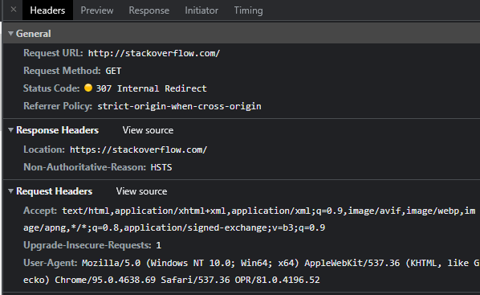
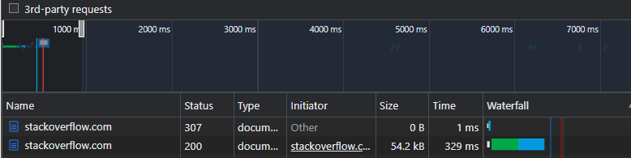

# Домашнее задание к занятию "3.6. Компьютерные сети, лекция 1"

1. Работа c HTTP через телнет.
- Подключитесь утилитой телнет к сайту stackoverflow.com
`telnet stackoverflow.com 80`
- отправьте HTTP запрос
```bash
GET /questions HTTP/1.0
HOST: stackoverflow.com
[press enter]
[press enter]
```
- В ответе укажите полученный HTTP код, что он означает?

```
HTTP/1.1 301 Moved Permanently
cache-control: no-cache, no-store, must-revalidate
location: https://stackoverflow.com/questions
x-request-guid: 9805fc36-6384-4f65-9aae-1437c71703c4
feature-policy: microphone 'none'; speaker 'none'
content-security-policy: upgrade-insecure-requests; frame-ancestors 'self' https://stackexchange.com
Accept-Ranges: bytes
Date: Fri, 26 Nov 2021 09:41:09 GMT
Via: 1.1 varnish
Connection: close
X-Served-By: cache-fra19133-FRA
X-Cache: MISS
X-Cache-Hits: 0
X-Timer: S1637919669.040969,VS0,VE92
Vary: Fastly-SSL
X-DNS-Prefetch-Control: off
Set-Cookie: prov=f79ec7c5-8621-618b-edb4-73b317afc871; domain=.stackoverflow.com; expires=Fri, 01-Jan-2055 00:00:00 GMT; path=/; HttpOnly

Connection closed by foreign host.
```
ресурс был на постоянной основе перемещён в новое месторасположение, https://stackoverflow.com/questions.

2. Повторите задание 1 в браузере, используя консоль разработчика F12.
- откройте вкладку `Network`
- отправьте запрос http://stackoverflow.com
- найдите первый ответ HTTP сервера, откройте вкладку `Headers`
- укажите в ответе полученный HTTP код.
- проверьте время загрузки страницы, какой запрос обрабатывался дольше всего?
- приложите скриншот консоли браузера в ответ.

`дольше всего обрабатывался запрос перенаправленной страницы`

3. Какой IP адрес у вас в интернете?
```
91.200.85.89
```
4. Какому провайдеру принадлежит ваш IP адрес? Какой автономной системе AS? Воспользуйтесь утилитой `whois`

```
netname:        RU-IGRA-SERVICE
AS33991

```
5. Через какие сети проходит пакет, отправленный с вашего компьютера на адрес 8.8.8.8? Через какие AS? Воспользуйтесь утилитой `traceroute`
```
vagrant@vagrant:~$ sudo traceroute -i eth1 -An 8.8.8.8
traceroute to 8.8.8.8 (8.8.8.8), 30 hops max, 60 byte packets
 1  192.168.1.1 [*]  0.871 ms  0.695 ms  0.450 ms
 2  172.17.254.129 [*]  1.645 ms  1.372 ms  1.404 ms
 3  100.64.3.2 [*]  1.389 ms  1.421 ms  1.181 ms
 4  188.234.142.178 [AS9049]  1.661 ms  1.622 ms  1.812 ms
 5  72.14.215.165 [AS15169]  50.414 ms  50.183 ms  50.250 ms
 6  72.14.215.166 [AS15169]  58.443 ms  58.420 ms  58.163 ms
 7  * * *
 8  108.170.226.172 [AS15169]  57.934 ms 108.170.225.36 [AS15169]  57.702 ms 108.170.250.33 [AS15169]  60.381 ms
 9  108.170.250.51 [AS15169]  181.094 ms 108.170.250.130 [AS15169]  56.903 ms 108.170.250.34 [AS15169]  55.683 ms
10  * * 142.251.49.158 [AS15169]  67.767 ms
11  216.239.57.222 [AS15169]  76.777 ms  75.367 ms 172.253.66.108 [AS15169]  75.838 ms
12  216.239.58.69 [AS15169]  74.095 ms 172.253.51.219 [AS15169]  79.693 ms 72.14.237.201 [AS15169]  73.631 ms
13  * * *
14  * * *
15  * * *
16  * * *
17  * * *
18  * * *
19  * * *
20  * * *
21  * 8.8.8.8 [AS15169]  255.788 ms *
```
6. Повторите задание 5 в утилите `mtr`. На каком участке наибольшая задержка - delay?

```
vagrant@vagrant:~$ mtr -zn 8.8.8.8
                                                                                            My traceroute  [v0.93]
vagrant (192.168.1.160)                                                                                                                                                              2021-11-27T06:57:59+0000
Keys:  Help   Display mode   Restart statistics   Order of fields   quit
                                                                                                                                                                     Packets               Pings
 Host                                                                                                                                                              Loss%   Snt   Last   Avg  Best  Wrst StDev
 1. AS???    192.168.1.1                                                                                                                                            0.0%    20    0.6   0.4   0.2   0.9   0.2
    AS???    10.0.2.2
 2. AS???    192.168.1.1                                                                                                                                            5.0%    20    1.1   1.3   1.0   2.9   0.4
 3. AS???    100.64.3.2                                                                                                                                             0.0%    20    2.9   3.5   1.5   5.8   1.4
    AS???    172.17.254.129
 4. AS???    100.64.3.2                                                                                                                                             0.0%    20    5.4   4.3   1.8   8.9   1.8
 5. AS15169  72.14.215.165                                                                                                                                          0.0%    20    4.0   7.4   2.0  51.1  11.2
    AS9049   188.234.142.178
 6. AS15169  72.14.215.165                                                                                                                                          0.0%    20   50.9  53.3  50.8  57.9   1.7
 7. AS15169  142.251.53.67                                                                                                                                          0.0%    20   61.7  61.5  58.7  69.7   2.5
    AS15169  72.14.215.166
 8. AS15169  142.251.53.67                                                                                                                                          0.0%    20   60.1  61.8  59.4  64.1   1.5
 9. AS15169  209.85.249.158                                                                                                                                        15.0%    20   54.7  57.1  52.5  77.8   5.9
    AS15169  108.170.250.83
10. AS15169  209.85.249.158                                                                                                                                        52.6%    20   78.7  76.3  74.9  80.2   1.9
11. AS15169  142.250.238.179                                                                                                                                        0.0%    20   79.0  81.5  75.9 125.7  10.7
    AS15169  74.125.253.94
12. AS15169  142.250.238.179                                                                                                                                        0.0%    20   76.7  77.5  75.2  85.5   2.2
13. (waiting for reply)
14. (waiting for reply)
15. (waiting for reply)
16. (waiting for reply)
17. (waiting for reply)
18. (waiting for reply)
19. AS15169  8.8.8.8                                                                                                                                               83.3%    19   76.4  79.5  76.3  85.8   5.5
```

```
самая большая зедержка(delay) на последнем этапе
```
7. Какие DNS сервера отвечают за доменное имя dns.google? Какие A записи? воспользуйтесь утилитой `dig`

```
dns.google.             10800   IN      NS      ns3.zdns.google.
dns.google.             10800   IN      NS      ns2.zdns.google.
dns.google.             10800   IN      NS      ns1.zdns.google.
dns.google.             10800   IN      NS      ns4.zdns.google.

dns.google.             900     IN      A       8.8.4.4
dns.google.             900     IN      A       8.8.8.8

```
8. Проверьте PTR записи для IP адресов из задания 7. Какое доменное имя привязано к IP? воспользуйтесь утилитой `dig`

```
;; ANSWER SECTION:
4.4.8.8.in-addr.arpa.   18870   IN      PTR     dns.google.
доменное имя dns.google.
;; ANSWER SECTION:
8.8.8.8.in-addr.arpa.   4537    IN      PTR     dns.google.
доменное имя dns.google.
```

В качестве ответов на вопросы можно приложите лог выполнения команд в консоли или скриншот полученных результатов.

---