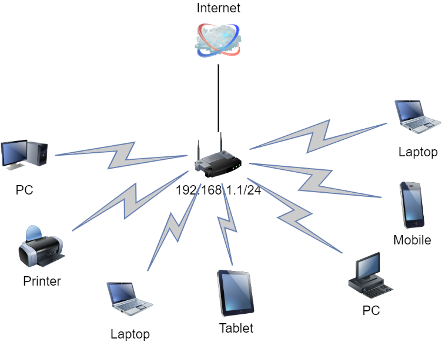

# Домашнее задание к занятию "3.8. Компьютерные сети, лекция 3"

1. Подключитесь к публичному маршрутизатору в интернет. Найдите маршрут к вашему публичному IP
```
telnet route-views.routeviews.org
Username: rviews
show ip route x.x.x.x/32
show bgp x.x.x.x/32
```

```
route-views>show ip route 91.200.85.89
Routing entry for 91.200.85.0/24
  Known via "bgp 6447", distance 20, metric 0
  Tag 2497, type external
  Last update from 202.232.0.2 3d05h ago
  Routing Descriptor Blocks:
  * 202.232.0.2, from 202.232.0.2, 3d05h ago
      Route metric is 0, traffic share count is 1
      AS Hops 3
      Route tag 2497
      MPLS label: none
route-views>show bgp 91.200.85.89
BGP routing table entry for 91.200.85.0/24, version 1388733734
Paths: (23 available, best #13, table default)
  Not advertised to any peer
  Refresh Epoch 1
  4901 6079 8359 33991
    162.250.137.254 from 162.250.137.254 (162.250.137.254)
      Origin IGP, localpref 100, valid, external
      Community: 65000:10100 65000:10300 65000:10400
      path 7FE04AD23A88 RPKI State not found
      rx pathid: 0, tx pathid: 0
  Refresh Epoch 3
  3303 12389 33991
    217.192.89.50 from 217.192.89.50 (138.187.128.158)
      Origin IGP, localpref 100, valid, external
      Community: 3303:1004 3303:1006 3303:1030 3303:3056
      path 7FE14F0175E0 RPKI State not found
      rx pathid: 0, tx pathid: 0
  Refresh Epoch 1
  3267 20485 33991
```

2. Создайте dummy0 интерфейс в Ubuntu. Добавьте несколько статических маршрутов. Проверьте таблицу маршрутизации.

```
vagrant@vagrant:~$ cat /etc/network/interfaces
# interfaces(5) file used by ifup(8) and ifdown(8)
# Include files from /etc/network/interfaces.d:
source-directory /etc/network/interfaces.d

auto dummy0
allow-hotplug dummy0
iface dummy0 inet static
  address 10.2.2.10
  netmask 255.255.255.0
  pre-up ip link add dummy0 type dummy
  post-up ip route add 10.2.2.0/24 dev dummy0 src 10.2.2.10 table mgmt
  post-up ip route add default via 10.2.2.1 dev dummy0 table mgmt
  post-up ip rule add from 10.2.2.10/32 table mgmt
  post-up ip rule add to 10.2.2.10/32 table mgmt
  post-down ip link del dummy0
  
vagrant@vagrant:~$ ip route
default via 10.0.2.2 dev eth0 proto dhcp src 10.0.2.15 metric 100
10.0.2.0/24 dev eth0 proto kernel scope link src 10.0.2.15
10.0.2.2 dev eth0 proto dhcp scope link src 10.0.2.15 metric 100
10.2.2.0/24 dev dummy0 proto kernel scope link src 10.2.2.10
```

3. Проверьте открытые TCP порты в Ubuntu, какие протоколы и приложения используют эти порты? Приведите несколько примеров.

```
vagrant@vagrant:~$ vagrant@vagrant:~$ ss -ltpn
State                   Recv-Q                  Send-Q                                     Local Address:Port                                     Peer Address:Port                  Process
LISTEN                  0                       4096                                             0.0.0.0:111                                           0.0.0.0:*
LISTEN                  0                       511                                              0.0.0.0:80                                            0.0.0.0:*
LISTEN                  0                       4096                                       127.0.0.53%lo:53                                            0.0.0.0:*
LISTEN                  0                       128                                              0.0.0.0:22                                            0.0.0.0:*
LISTEN                  0                       4096                                                [::]:111                                              [::]:*
LISTEN                  0                       511                                                 [::]:80                                               [::]:*
LISTEN                  0                       128                                                 [::]:22                                               [::]:*


:22 - это ssh
:80 - nginx
:53 - dns
```

4. Проверьте используемые UDP сокеты в Ubuntu, какие протоколы и приложения используют эти порты?

```
vagrant@vagrant:~$ ss -lupn
State                   Recv-Q                  Send-Q                                     Local Address:Port                                     Peer Address:Port                  Process
UNCONN                  0                       0                                          127.0.0.53%lo:53                                            0.0.0.0:*
UNCONN                  0                       0                                         10.0.2.15%eth0:68                                            0.0.0.0:*
UNCONN                  0                       0                                                0.0.0.0:111                                           0.0.0.0:*
UNCONN                  0                       0                                                   [::]:111                                              [::]:*


:53 - dns
:68 - dhcp
```

5. Используя diagrams.net, создайте L3 диаграмму вашей домашней сети или любой другой сети, с которой вы работали. 



 ---
## Задание для самостоятельной отработки (необязательно к выполнению)

6*. Установите Nginx, настройте в режиме балансировщика TCP или UDP.

7*. Установите bird2, настройте динамический протокол маршрутизации RIP.

8*. Установите Netbox, создайте несколько IP префиксов, используя curl проверьте работу API.

 ---