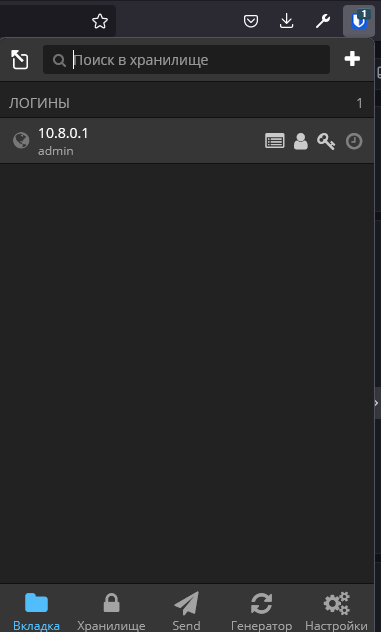
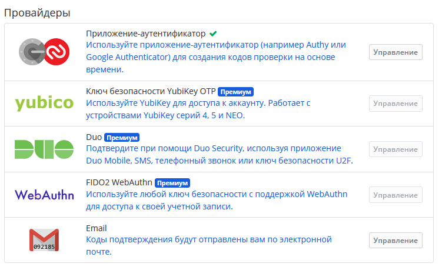
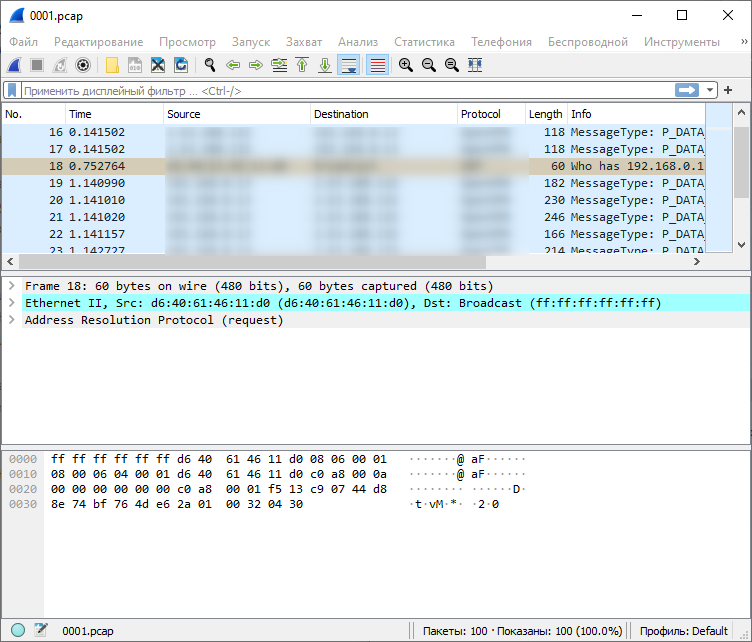

# Домашнее задание к занятию "3.9. Элементы безопасности информационных систем"

1. Установите Bitwarden плагин для браузера. Зарегестрируйтесь и сохраните несколько паролей.



2. Установите Google authenticator на мобильный телефон. Настройте вход в Bitwarden акаунт через Google authenticator OTP.



3. Установите apache2, сгенерируйте самоподписанный сертификат, настройте тестовый сайт для работы по HTTPS.

```
$ sudo systemctl status nginx
● nginx.service - A high performance web server and a reverse proxy server
     Loaded: loaded (/lib/systemd/system/nginx.service; enabled; vendor preset: enabled)
     Active: active (running) since Tue 2021-12-07 10:09:01 UTC; 1s ago
       Docs: man:nginx(8)
    Process: 1630433 ExecStartPre=/usr/sbin/nginx -t -q -g daemon on; master_process on; (code=exited, status=0/SUCCESS)
    Process: 1630463 ExecStart=/usr/sbin/nginx -g daemon on; master_process on; (code=exited, status=0/SUCCESS)
   Main PID: 1630464 (nginx)
      Tasks: 2 (limit: 4583)
     Memory: 3.8M
     CGroup: /system.slice/nginx.service
             ├─1630464 nginx: master process /usr/sbin/nginx -g daemon on; master_process on;
             └─1630465 nginx: worker process


~/testssl.sh$ ./testssl.sh -e --fast --parallel 10.8.0.1

###########################################################
    testssl.sh       3.1dev from https://testssl.sh/dev/
    (0eb73d9 2021-12-07 08:55:54 -- )

      This program is free software. Distribution and
             modification under GPLv2 permitted.
      USAGE w/o ANY WARRANTY. USE IT AT YOUR OWN RISK!

       Please file bugs @ https://testssl.sh/bugs/

###########################################################

 Using "OpenSSL 1.0.2-chacha (1.0.2k-dev)" [~183 ciphers]
 on linux:./bin/openssl.Linux.x86_64
 (built: "Jan 18 17:12:17 2019", platform: "linux-x86_64")


 Start 2021-12-07 10:23:22        -->> 10.8.0.1:443 (10.8.0.1) <<--

```

4. Проверьте на TLS уязвимости произвольный сайт в интернете.

```
~/testssl.sh$ ./testssl.sh -U --sneaky 10.8.0.1

###########################################################
    testssl.sh       3.1dev from https://testssl.sh/dev/
    (0eb73d9 2021-12-07 08:55:54 -- )

      This program is free software. Distribution and
             modification under GPLv2 permitted.
      USAGE w/o ANY WARRANTY. USE IT AT YOUR OWN RISK!

       Please file bugs @ https://testssl.sh/bugs/

###########################################################

 Using "OpenSSL 1.0.2-chacha (1.0.2k-dev)" [~183 ciphers]
 on linux:./bin/openssl.Linux.x86_64
 (built: "Jan 18 17:12:17 2019", platform: "linux-x86_64")


 Start 2021-12-07 10:26:33        -->> 10.8.0.1:443 (10.8.0.1) <<--

 rDNS (10.8.0.1):        linux. linux.local.
 Service detected:       HTTP


 Testing vulnerabilities

 Heartbleed (CVE-2014-0160)                not vulnerable (OK), no heartbeat extension
 CCS (CVE-2014-0224)                       not vulnerable (OK)
 Ticketbleed (CVE-2016-9244), experiment.  not vulnerable (OK), no session ticket extension
 ROBOT                                     Server does not support any cipher suites that use RSA key transport
 Secure Renegotiation (RFC 5746)           supported (OK)
 Secure Client-Initiated Renegotiation     not vulnerable (OK)
 CRIME, TLS (CVE-2012-4929)                not vulnerable (OK)
 BREACH (CVE-2013-3587)                    potentially NOT ok, "gzip" HTTP compression detected. - only supplied "/" tested
                                           Can be ignored for static pages or if no secrets in the page
 POODLE, SSL (CVE-2014-3566)               not vulnerable (OK)
 TLS_FALLBACK_SCSV (RFC 7507)              No fallback possible (OK), no protocol below TLS 1.2 offered
 SWEET32 (CVE-2016-2183, CVE-2016-6329)    not vulnerable (OK)
 FREAK (CVE-2015-0204)                     not vulnerable (OK)
 DROWN (CVE-2016-0800, CVE-2016-0703)      not vulnerable on this host and port (OK)
                                           no RSA certificate, thus certificate can't be used with SSLv2 elsewhere
 LOGJAM (CVE-2015-4000), experimental      not vulnerable (OK): no DH EXPORT ciphers, no common prime detected
 BEAST (CVE-2011-3389)                     not vulnerable (OK), no SSL3 or TLS1
 LUCKY13 (CVE-2013-0169), experimental     potentially VULNERABLE, uses cipher block chaining (CBC) ciphers with TLS. Check patches
 Winshock (CVE-2014-6321), experimental    not vulnerable (OK) - ARIA, CHACHA or CCM ciphers found
 RC4 (CVE-2013-2566, CVE-2015-2808)        no RC4 ciphers detected (OK)


 Done 2021-12-07 10:26:49 [  18s] -->> 10.8.0.1:443 (10.8.0.1) <<--
```

5. Установите на Ubuntu ssh сервер, сгенерируйте новый приватный ключ. Скопируйте свой публичный ключ на другой сервер. Подключитесь к серверу по SSH-ключу.

```
~$ sudo systemctl status ssh
● ssh.service - OpenBSD Secure Shell server
     Loaded: loaded (/lib/systemd/system/ssh.service; enabled; vendor preset: enabled)
     Active: active (running) since Mon 2021-12-06 07:17:11 UTC; 2 days ago
       Docs: man:sshd(8)
             man:sshd_config(5)
   Main PID: 979 (sshd)
      Tasks: 1 (limit: 4583)
     Memory: 8.5M
     CGroup: /system.slice/ssh.service
             └─979 sshd: /usr/sbin/sshd -D [listener] 0 of 10-100 startups
```
```
C:/> ssh-keygen
Generating public/private rsa key pair.
Enter file in which to save the key (/users/123/.ssh/id_rsa):
Enter passphrase (empty for no passphrase):
Enter same passphrase again:
Your identification has been saved in /users/123/.ssh/id_rsa.
Your public key has been saved in /users/123/.ssh/id_rsa.pub.
The key fingerprint is:
SHA256:/f+dV3NcNPrwVfvfAKbWe5VcfZeJkwXV0Fo8PusTcSs 123@DESKTOP-J2OBBBC
The key's randomart image is:
...
```
```
C:/> ssh-copy-id -i /users/123/.ssh/id_rsa.pub linux@10.8.0.1
/bin/ssh-copy-id: INFO: attempting to log in with the new key(s), to filter out any that are already installed
/bin/ssh-copy-id: INFO: 1 key(s) remain to be installed -- if you are prompted now it is to install the new keys
stty: standard input: Inappropriate ioctl for device

Number of key(s) added: 1

Now try logging into the machine, with:   "ssh 'linux@10.8.0.1'"
and check to make sure that only the key(s) you wanted were added.
```
```
C:/> ssh linux@10.8.0.1
Welcome to Ubuntu 20.04.3 LTS (GNU/Linux 5.4.0-91-generic x86_64)

 * Documentation:  https://help.ubuntu.com
 * Management:     https://landscape.canonical.com
 * Support:        https://ubuntu.com/advantage

  System information as of Чт 09 дек 2021 03:37:37 UTC


Last login: Thu Dec  9 03:10:06 2021 from 10.8.0.6
```


6. Переименуйте файлы ключей из задания 5. Настройте файл конфигурации SSH клиента, так чтобы вход на удаленный сервер осуществлялся по имени сервера.

``` config
Host linux
	hostname 10.8.0.1
    Port 22
	User user
	IdentityFile C:\Users\123\.ssh\id_linux_rsa
	CertificateFile C:\Users\123\.ssh\id_linux_rsa.pub
```
```
C:\>ssh linux
Enter passphrase for key 'C:\Users\123/.ssh/id_linux_rsa':
Welcome to Ubuntu 20.04.3 LTS (GNU/Linux 5.4.0-91-generic x86_64)

 * Documentation:  https://help.ubuntu.com
 * Management:     https://landscape.canonical.com
 * Support:        https://ubuntu.com/advantage

  System information as of Чт 09 дек 2021 03:47:49 UTC
  ...
```

7. Соберите дамп трафика утилитой tcpdump в формате pcap, 100 пакетов. Откройте файл pcap в Wireshark.

```
user@linux:~$ sudo tcpdump -c 100 -w 0001.pcap -i eth0
tcpdump: listening on eth0, link-type EN10MB (Ethernet), capture size 262144 bytes
100 packets captured
114 packets received by filter
0 packets dropped by kernel
```



 ---
